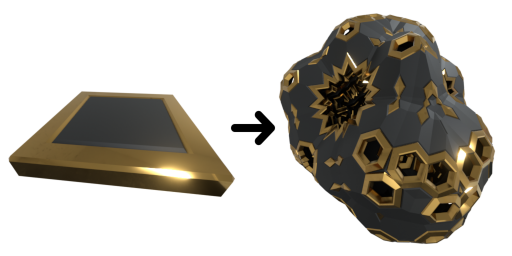
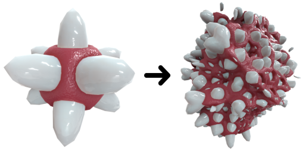
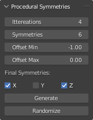

# Procedural Symmetries
This Blender add-on automates the process of iteratively applying a set of reflection planes to a base mesh.
The result will conserve the properties of the base mesh such as water-tightness, surface material and vertex properties.

## Examples:

## Installation:
To install this add-on you can directly install 'ProceduralSymmetries.py' from the Blender Add-ons panel under Preference.

## Usage:

This panel will be under Tools and is used in Object mode in the 3d View.
- Iterations: the number of times that the symmetry planes are applied
- Symmetries: the number of symmetry planes
- Offset Min: the lower bound on the offset of a symmetry plane from origin
- Offset Max: the upper bound on the offset of a symmetry plane from origin
- Final Symmetry: apply a final symmetry on one or more of the main axis
- Generate: setup the modifiers and child objects on a mesh, this will first remove any pre-existing modifiers or children on the selected mesh
- Randomize: Shuffle the symmetry planes on the selected mesh

With both Offset Min and Offset Max smaller or equal to 0; Generate or Randomize is garanteed to produce something, otherwise the result may be empty.

To apply the effect you can simply use Blender Convert to Mesh option.
